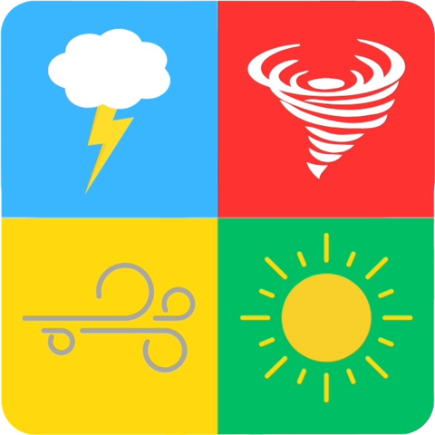
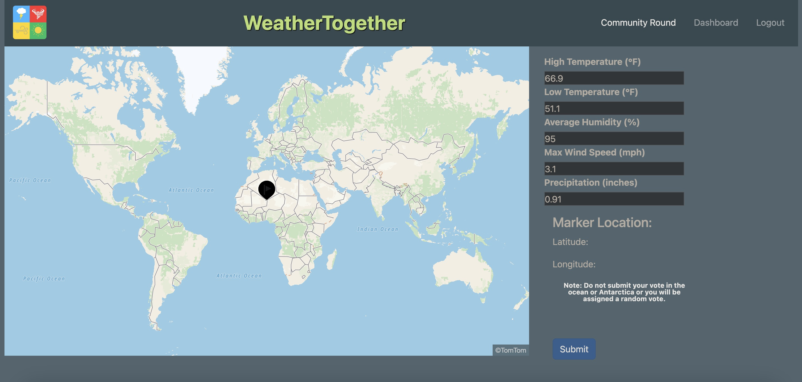

<!-- PROJECT LOGO -->
<br />
<div align="center">
  <a href="https://github.com/Weather-Together/weather_together_be">
    
  </a>

<h3 align="center">Weather Together</h3>

  <p align="center">
    Weather Together is a game app where a daily set of weather data is displayed to the user (player) from a randomly selected location in the world. Each day the player guesses a location where they think this weather data was collected through an interactive map selector. They are able to keep track of prior guesses as well as track their progress on a leaderboard.

The goal of this app is to provide public education and increase awareness of general global climate trends in a fun and interactive manner.

This repo is a microservice that will reverse geocode picked locations, and then find pictures and a wikipedia article for that location. It is my very first attempt at coding in Java, and using the Springboot framework. Learning has been 100% self guided.
    <br />
    <a href="https://github.com/Weather-Together/location_information_microservice"><strong>Explore the docs »</strong></a>
    <br />
    <br />
    <a href="https://github.com/Weather-Together/location_information_microservice">View Demo</a>
    ·
    <a href="https://github.com/Weather-Together/location_information_microservice/issues">Report Bug</a>
    ·
    <a href="https://github.com/Weather-Together/location_information_microservice/issues">Request Feature</a>
  </p>
</div>

<!-- TABLE OF CONTENTS -->
<details>
  <summary>Table of Contents</summary>
  <ol>
    <li>
      <a href="#about-the-project">About The Project</a>
      <ul>
        <li><a href="#built-with">Built With</a></li>
        <li><a href="#gems">Gems</a></li>
      </ul>
    </li>
    <li>
      <a href="#getting-started">Getting Started</a>
      <ul>
        <li><a href="#prerequisites">Prerequisites</a></li>
        <li><a href="#installation">Installation</a></li>
      </ul>
    </li>
    <li><a href="#usage">Usage</a></li>
    <li><a href="#roadmap">Roadmap</a></li>
    <li><a href="#contact">Contact</a></li>
    <li><a href="#contributors">Contributors</a></li>
  </ol>
</details>


<!-- ABOUT THE PROJECT -->
## About The Project



[](https://weather-together.onrender.com/)

### Built With
* [![Spring-Boot][Rails-shield]][Rails-url]
* [![Java][Java-shield]][Java-url]
* [![PostgreSQL][PostgreSQL-shield]][PostgreSQL-url]

<p align="right">(<a href="#readme-top">back to top</a>)</p>

### Beans

N/A - left in for future template
* [![debug][gem-debug]][gem-debug-url]

<p align="right">(<a href="#readme-top">back to top</a>)</p>

<!-- GETTING STARTED -->
## Getting Started

To get a local copy up and running follow these simple example steps.

### Installation

These instructions assume you have Java, Spring Boot and Maven properly installed on your machine.

1. Get a free Geocoding API Key at [https://geocode.maps.co/](https://geocode.maps.co/)

1. Get a free Unsplash API Key at [https://unsplash.com/developers](https://unsplash.com/developers)

2. Clone the repo
   ```sh
   git clone git@github.com:Weather-Together/location_information_microservice.git
   ```
3. Get Maven running
  Terminal
   ```sh
   mvn clean install
   ```
4. Start up local host
   ```sh
    mvn spring-boot:run
   ```
5. Start making queries!
   ```sh
    curl -X GET https://seahorse-app-ybzev.ondigitalocean.app/api/v0/information?lat=50&lon=-100&image_api_key=<YOUR IMAGE API KEY>&geo_api_key=<YOUR GEO API KEY>
   ```

<p align="right">(<a href="#readme-top">back to top</a>)</p>


<!-- USAGE EXAMPLES -->
## Usage


This portion of the app is supplemental to the daily vote portion of the game:
* It will take latitude and longitude from an API call
* Consumes external geocoding API and determines the named location
* Based on output from the geocoding API, consumes the external wiki API and finds an article for the region
* Consumes the external image API and finds an image for the region
* Returns these assets to the primary backend app

<p align="right">(<a href="#readme-top">back to top</a>)</p>


<!-- ROADMAP -->
## Roadmap

- [X] API Consumption
    - [X] Call Services
    - [X] Endpoints to be Consumed by Frontend
- [x] Deploy
- [ ] Clean up JSON parse
- [ ] Try to find data for as specific a location as possible (if city present, use, etc.)
- [ ] Better manage sad path
- [ ] Store new calls in database
- [ ] Use database stored calls when out of image API calls


See the [open issues](https://github.com/Weather-Together/location_information_microservice/issues) for a full list of proposed features (and known issues).

<p align="right">(<a href="#readme-top">back to top</a>)</p>


## API Endpoints

### Recent Rounds
* **GET /api/v0/rounds/recent_rounds**
  - Controller: Api::V0::RoundsController#recent_rounds
  - Example Request:
    ```
    curl -X GET https://seahorse-app-ybzev.ondigitalocean.app/api/v0/information?lat=50&lon=-100&image_api_key=<YOUR IMAGE API KEY>&geo_api_key=<YOUR GEO API KEY>
    ```
  - Example Response:
    ```json
    {
    "country": "Canada",
    "images":"https://images.unsplash.com/photo-1632455351235-682d08cbb3e0?ixid=M3w1NjQyMzV8MHwxfHNlYXJjaHwxfHxNYW5pdG9iYXxlbnwwfHx8fDE3MDc1ODg5NDN8MA\&ixlib=rb-4.0.3",
    "city": null,
    "wiki": "https://en.wikipedia.org/wiki/Manitoba",
    "lon": "-100",
    "state": "Manitoba",
    "lat": "50"
    }
    ```

<!-- CONTACT -->
## Contact

Organization: Weather Together - WeatherTogether2308@gmail.com

Organization Link: [https://github.com/Weather-Together](https://github.com/Weather-Together)

Project Link: [https://github.com/Weather-Together/location_information_microservice](https://github.com/Weather-Together/location_information_microservice)

<p align="right">(<a href="#readme-top">back to top</a>)</p>


## Contributors

Michael Kuhlmeier 
 
[![LinkedIn][linkedin-shield]][linkedin-url-mk]
[![GitHub][github-shield-mk]][github-url-mk]


<!-- MARKDOWN LINKS & IMAGES -->
<!-- https://www.markdownguide.org/basic-syntax/#reference-style-links -->
[contributors-shield]: https://img.shields.io/github/contributors/Weather-Together/weather_together_fe.svg?style=for-the-badge
[contributors-url]: https://github.com/Weather-Together/weather_together_fe/graphs/contributors
[forks-shield]: https://img.shields.io/github/forks/Weather-Together/weather_together_fe.svg?style=for-the-badge
[forks-url]: https://github.com/Weather-Together/weather_together_fe/network/members
[stars-shield]: https://img.shields.io/github/stars/Weather-Together/weather_together_fe.svg?style=for-the-badge
[stars-url]: https://github.com/Weather-Together/weather_together_fe/stargazers
[issues-shield]: https://img.shields.io/github/issues/Weather-Together/weather_together_fe.svg?style=for-the-badge
[issues-url]: https://github.com/Weather-Together/weather_together_fe/issues
[license-shield]: https://img.shields.io/github/license/Weather-Together/weather_together_fe.svg?style=for-the-badge
[license-url]: https://github.com/Weather-Together/weather_together_fe/blob/master/LICENSE.txt
[linkedin-shield]: https://img.shields.io/badge/-LinkedIn-black.svg?style=for-the-badge&logo=linkedin&colorB=555
[linkedin-url-st]: https://www.linkedin.com/in/sam-t-tran
[linkedin-url-mk]: https://www.linkedin.com/in/michaelkuhlmeier
[linkedin-url-bk]: https://www.linkedin.com/in/blaine-kennedy
[Rails-shield]: https://img.shields.io/badge/Spring%20Boot-6DB33F?style=for-the-badge&logo=spring-boot&logoColor=white
[Rails-url]: https://spring.io/projects/spring-boot
[Java-shield]: https://img.shields.io/badge/Java-5382a1?style=for-the-badge&logo=apache&logoColor=black
[Java-url]: https://dev.java/
[PostgreSQL-shield]: https://img.shields.io/badge/PostgreSQL-336791?style=for-the-badge&logo=postgresql&logoColor=white
[PostgreSQL-url]: https://www.postgresql.org/

[gem-debug]: https://img.shields.io/badge/debug-1.9.1-brightgreen?style=flat-square
[gem-debug-url]: https://rubygems.org/gems/debug

[gem-rspec-rails]: https://img.shields.io/badge/rspec--rails-6.1.0-green?style=flat-square
[gem-rspec-rails-url]: https://github.com/rspec/rspec-rails

[gem-simplecov]: https://img.shields.io/badge/simplecov-0.22.0-yellow?style=flat-square
[gem-simplecov-url]: https://github.com/simplecov-ruby/simplecov

[gem-factory_bot_rails]: https://img.shields.io/badge/factory_bot_rails-6.4.0-success?style=flat-square
[gem-factory_bot_rails-url]: https://github.com/thoughtbot/factory_bot_rails

[gem-faker]: https://img.shields.io/badge/faker-3.2.2-red?style=flat-square
[gem-faker-url]: https://github.com/faker-ruby/faker

[gem-pry]: https://img.shields.io/badge/pry-0.14.2-yellow?style=flat-square
[gem-pry-url]: https://github.com/pry/pry

[gem-shoulda-matchers]: https://img.shields.io/badge/shoulda--matchers-6.0.0-orange?style=flat-square
[gem-shoulda-matchers-url]: https://github.com/thoughtbot/shoulda-matchers

[gem-faraday]: https://img.shields.io/badge/faraday-2.8.1-yellowgreen?style=flat-square
[gem-faraday-url]: https://github.com/lostisland/faraday

[gem-figaro]: https://img.shields.io/badge/figaro-1.2.0-critical?style=flat-square
[gem-figaro-url]: https://github.com/laserlemon/figaro

[gem-jsonapi-serializer]: https://img.shields.io/badge/jsonapi--serializer-2.2.0-blue?style=flat-square
[gem-jsonapi-serializer-url]: https://github.com/jsonapi-serializer/jsonapi-serializer

[gem-capybara]: https://img.shields.io/badge/capybara-3.39.2-brightgreen?style=flat-square
[gem-capybara-url]: https://github.com/teamcapybara/capybara

[gem-webmock]: https://img.shields.io/badge/webmock-3.19.1-yellowgreen?style=flat-square
[gem-webmock-url]: https://github.com/bblimke/webmock

[gem-vcr]: https://img.shields.io/badge/vcr-6.2.0-orange?style=flat-square
[gem-vcr-url]: https://github.com/vcr/vcr


[github-shield-mk]: https://img.shields.io/badge/GitHub-mbkuhl-success?style=for-the-badge&logo=github
[github-url-mk]: https://github.com/mbkuhl

[github-shield-jo]: https://img.shields.io/badge/GitHub-Captainlearyo-success?style=for-the-badge&logo=github
[github-url-jo]: https://github.com/Captainlearyo

[github-shield-st]: https://img.shields.io/badge/GitHub-Sykogst-success?style=for-the-badge&logo=github
[github-url-st]: https://github.com/Sykogst

[github-shield-kz]: https://img.shields.io/badge/GitHub-zkevkev-success?style=for-the-badge&logo=github
[github-url-kz]: https://github.com/zkevkev

[github-shield-bk]: https://img.shields.io/badge/GitHub-bkchilidawg-success?style=for-the-badge&logo=github
[github-url-bk]: https://github.com/bkchilidawg
